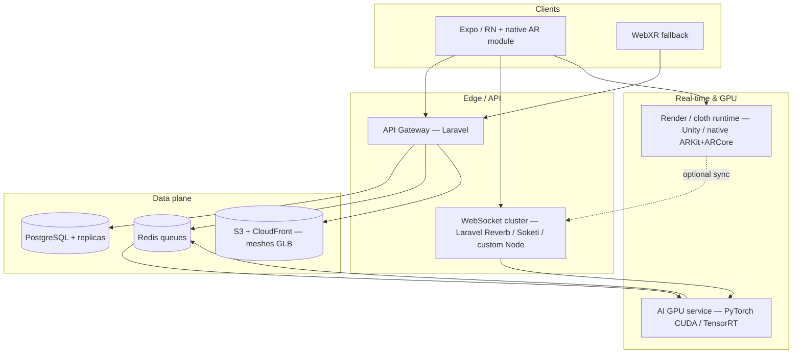

# Virtual try-on & AR — target production architecture (Phase 3)

This document describes how the **existing** Laravel + Python AI + Expo monorepo **extends** toward a Zara/Nike-class AR try-on. It is the **blueprint**; full cloth physics and sub-50ms GPU pipelines require **native AR engines** and **GPU infrastructure** not fully shipped in this repository (see [README.md](../README.md) Phase 3 status).

## High-level diagram

## Service responsibilities

| Service | Role |
|--------|------|
| **Laravel API** | Auth, catalog, measurements, garment **asset metadata** (GLB paths, physics JSON, pipeline status), dispatches **GPU/AR jobs**. |
| **WebSocket / SSE** | Low-latency **pose/cloth state** to clients (Laravel **Reverb** or horizontally scaled **Soketi** / Node gateway). |
| **AI GPU service** | **CUDA** pose (upgrade from CPU MediaPipe or hybrid), **motion smoothing**, optional **cloth deformation** ML head; **TensorRT** for fixed-shape models. |
| **Cloth / AR runtime** | **Not in pure JS**: **ARKit (iOS)** / **ARCore (Android)** for camera + depth; **Unity** (PhysX cloth) or **Unreal** for physics-quality simulation; RN via **Unity as a library** or **custom native module**. |
| **Asset pipeline** | **Blender/Marvelous** (artist + automation) → GLB + **physics_profile** JSON → **OptimizeMeshJob** → S3 + CDN. |

## Latency budget (target)

| Segment | Target | Notes |
|---------|--------|--------|
| Camera → local skeleton | &lt; 16–33 ms | On-device ARKit/ARCore body tracking preferred. |
| Optional cloud pose refine | +20–40 ms | Batch small; often skip for AR path. |
| Cloth solve (local) | 1–2 frames | GPU cloth on device or simplified spring-mesh. |
| WebSocket round-trip | &lt; 30 ms | Same region; binary payloads; no blocking Laravel in hot path. |

**Reality check:** Sub-50 ms **end-to-end** with **server-side** cloth per frame is uncommon; production systems usually **solve cloth on device** and use the server for **catalog, fit ML, recording**.

## Modular boundaries

- **AI must stay a separate deployable** (already: `ai-service/`). GPU image: `ai-service/docker/Dockerfile.cuda` (stub).
- **Laravel must not run PyTorch**; it **queues** jobs and **proxies** optional REST (`/api/ai/realtime-pose` → GPU service).
- **WebSockets** terminate on a **dedicated** process (Reverb/Node), not `php artisan serve` alone at scale.

## Repo mapping (what exists vs planned)

| Path | Purpose |
|------|---------|
| `backend/app/Jobs/Vton/*` | Stubs: cloth simulation, AR model gen, mesh optimize, fit prediction. |
| `backend/database/migrations/*_vton_*` | Garment **mesh + physics** metadata. |
| `backend/app/Http/Controllers/Api/RealtimePoseController.php` | REST entry for pose JSON (stub / proxy). |
| `ai-service/app/realtime_pose.py` | Stub **skeleton** response; replace with GPU model. |
| `mobile/src/screens/ARTryOnScreen.tsx` | **Placeholder** camera UI; swap body for **native AR**. |
| `docs/DEPLOYMENT_PRODUCTION.md` | K8s / cloud sketch. |
