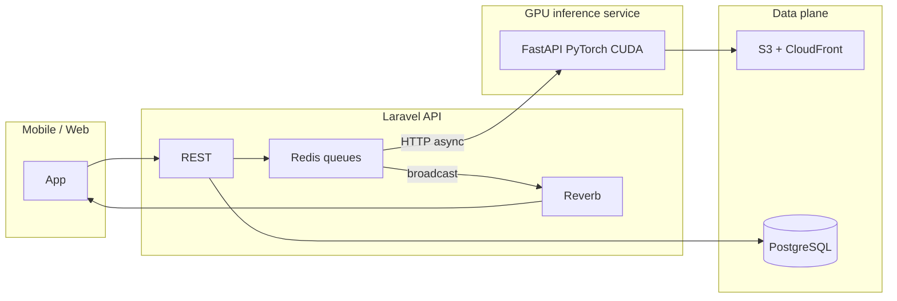

# Phase 3 — Laravel orchestration + GPU microservice

This document describes the **production-oriented split** implemented in the monorepo: **Laravel never runs ML inference**; **queue jobs** call a separate **GPU-capable Python service** over HTTP; **real-time UX** uses **Laravel Reverb** (or Soketi, Pusher-compatible) instead of polling.

## Service boundaries



## Redis queues (workload isolation)

Run:

```bash
php artisan queue:work redis --queue=scans,fits,vton-gpu,assets,default
```

| Queue       | Jobs |
|------------|------|
| `scans`    | `ScanBodyJob` |
| `fits`     | `GenerateFitRecommendationJob` |
| `vton-gpu` | `VtonGpuJob`, `FitPredictionJob` |
| `assets`   | `VtonAssetPipelineJob` |
| `default`  | `RealtimePoseInferenceJob`, broadcast queue for `ShouldBroadcast` events |

## Jobs → GPU HTTP

| Job | Endpoint | Laravel service |
|-----|----------|-----------------|
| `ScanBodyJob` | `POST /infer/pose` (multipart) | `GpuInferenceClient` |
| `RealtimePoseInferenceJob` | `POST /infer/pose` (JSON) | `GpuInferenceClient` |
| `VtonGpuJob` | `POST /infer/tryon` | `GpuInferenceClient` |
| `FitPredictionJob` | `POST /infer/fit` | `GpuInferenceClient` |

Configuration: `config/services.php` → `gpu.base_url` (`GPU_SERVICE_URL`, defaulting to `AI_SERVICE_URL` for local dev).

## Real-time broadcasting

- **Reverb** is installed; set `BROADCAST_CONNECTION=reverb` and run `php artisan reverb:start` in production (see `config/reverb.php`).
- **Broadcast auth:** `POST /broadcasting/auth` uses `auth:sanctum` (see `bootstrap/app.php` + `withBroadcasting`).
- **Channels:** `user.{id}`, `user.{id}.pose`, `user.{id}.cloth` (see `routes/channels.php`).

| Event | Broadcast name | Channel |
|-------|----------------|---------|
| `FitUpdated` | `fit.updated` | `private-user.{id}` |
| `PoseUpdated` | `pose.updated` | `private-user.{id}.pose` |
| `VtonProgress` | `vton.progress` | `private-user.{id}.cloth` |

`PoseUpdated` and `FitUpdated` use **`ShouldBroadcastNow`** so clients see results as soon as the job finishes. `VtonProgress` uses **`ShouldBroadcast`** (queued) for pipeline steps.

## Asset pipeline (S3 + CloudFront)

`VtonAssetPipelineJob` writes to **`config('filesystems.default')`** (use `FILESYSTEM_DISK=s3` in production). Outputs:

- `garments/{id}/model.glb` — stub until Blender/Marvelous pipeline fills real bytes.
- `garments/{id}/physics_profile.json` — stub JSON until DCC export.

Set **`mesh_cdn_url`** when fronting the bucket with **CloudFront** (not automated in the stub job).

## Python service evolution

Today, `/infer/pose` multipart reuses the existing **MediaPipe** path; JSON branch returns a **pose stub**. Replace internals with **PyTorch CUDA** and optional **TensorRT** without changing Laravel contracts.

## Legacy

- `POST /v1/estimate-measurements` remains for direct tooling; Laravel scan flow uses **`/infer/pose`** via `GpuInferenceClient`.
- Older `App\Jobs\Vton\*` mesh stubs are **not** dispatched by `vton/rebuild` anymore; use `VtonAssetPipelineJob` or extend it.
